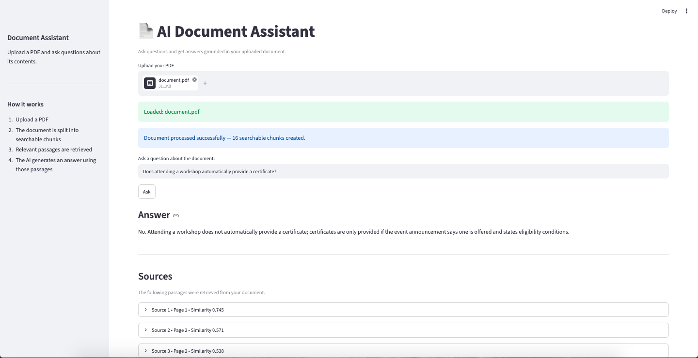

# AI-Powered Document Assistant

An AI-powered document question-answering system that allows users
to upload a PDF and ask questions about its contents.

The system retrieves relevant passages from the document and uses
an LLM to generate an answer based only on the retrieved context.

## 📸 Demo



## Features

- Upload a PDF document
- Extract text page by page
- Split the document into searchable chunks
- Generate embeddings for document chunks
- Retrieve relevant passages using semantic similarity
- Generate answers using an LLM
- Show the source pages and retrieved passages
- Handle questions whose answers are not present in the document
- Streamlit-based user interface

## How It Works

The system follows a Retrieval-Augmented Generation (RAG) pipeline:

PDF
↓
Text Extraction
↓
Chunking
↓
Embeddings
↓
Semantic Retrieval
↓
LLM
↓
Grounded Answer + Sources

### 1. Text Extraction

The uploaded PDF is processed using `pypdf`.

Text is extracted page by page while keeping the original
page number.

### 2. Chunking

The extracted text is divided into smaller chunks.

The final configuration uses:

- Chunk size: 500 characters
- Overlap: 100 characters

The overlap helps preserve context between neighboring chunks.

### 3. Embeddings

Each document chunk is converted into a numerical vector
using:

`all-MiniLM-L6-v2`

The same model is used to convert the user's question into
an embedding.

### 4. Retrieval

The question embedding is compared with the document chunk
embeddings using cosine-style similarity.

The top 3 most relevant chunks are selected.

### 5. Answer Generation

The retrieved passages are provided to the LLM as context.

The model is instructed to:

- Use only the provided document context
- Not use outside knowledge
- Not make up information
- State when the answer cannot be found

### 6. Source Handling

Every retrieved chunk retains its original PDF page number.

The application displays the source page, similarity score,
and retrieved passage so that the answer can be verified.

## Technology Stack

- Python
- pypdf
- Sentence Transformers
- all-MiniLM-L6-v2
- NumPy
- OpenRouter API
- Qwen Qwen3.8 27B
- Streamlit

## Project Structure

```text
ai-document-assistant/
│
├── data/
│   ├── document.pdf
│   ├── chunks.json
│   └── embeddings.npy
│
├── src/
│   ├── app.py
│   ├── extract_text.py
│   ├── chunk_text.py
│   ├── embed_chunks.py
│   ├── retrieve.py
│   ├── test_llm.py
│   ├── qa_pipeline.py
│   └── build_index.py
│
├── .env.example
├── .gitignore
├── DECISIONS.md
├── README.md
└── requirements.txt
```
## Running the Project

Create and activate the Python environment:

```bash
python3.11 -m venv .venv311
source .venv311/bin/activate
```
Install the required dependencies:

```bash
pip install -r requirements.txt
```
Create a .env file in the project root and add your OpenRouter API key:

OPENROUTER_API_KEY=your_api_key_here

Run the Streamlit application:

```bash
streamlit run src/app.py
```
The application will open in your browser.

Upload a PDF document using the file uploader and then enter
a question about the document.

The system will retrieve relevant passages from the document
and generate an answer using the retrieved context.

## Evaluation

The system was tested with multiple questions, including:

- What are the opening hours of the Student Support Desk?
- What broad areas does GDG On Campus USAR organize learning activities in?
- Does attending a workshop automatically provide a certificate?
- What should a project repository include according to the handbook?
- Who is the current community lead?

The final question is intentionally outside the document.

The system responded that the answer could not be found
in the document instead of using outside knowledge.

## Chunking Experiment

Two configurations were tested.

### Configuration A

- Chunk size: 500 characters
- Overlap: 0 characters
- Number of chunks: 13

### Configuration B

- Chunk size: 500 characters
- Overlap: 100 characters
- Number of chunks: 16

Configuration B was selected because overlapping chunks
help preserve context between neighboring sections.

More details about the experiments and design decisions
are documented in `DECISIONS.md`.